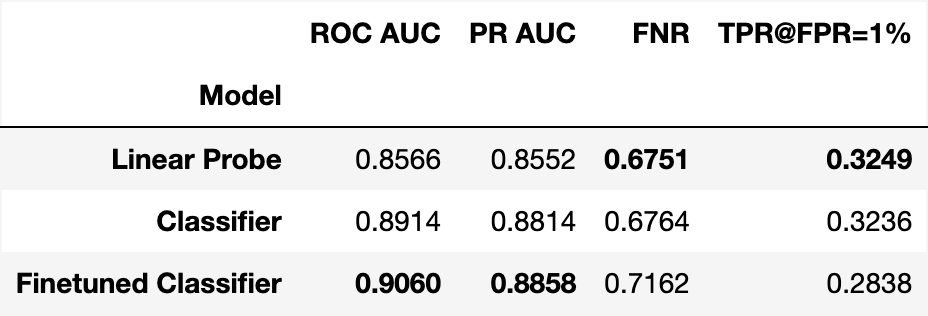
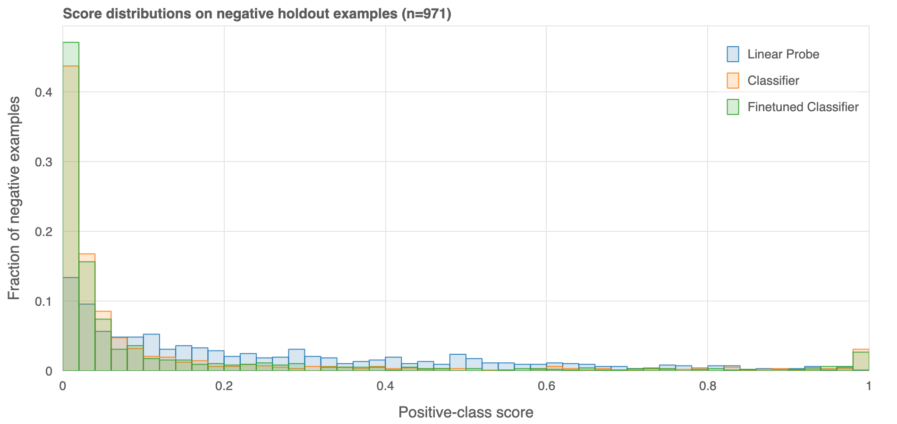
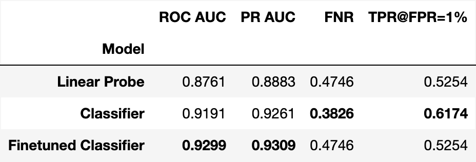
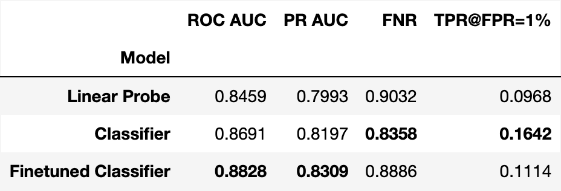
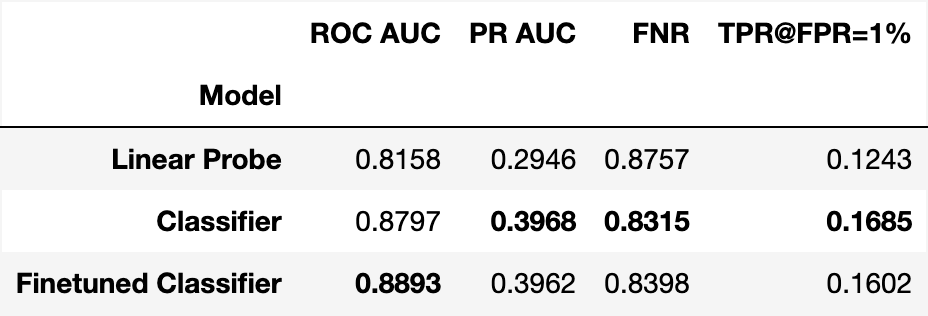
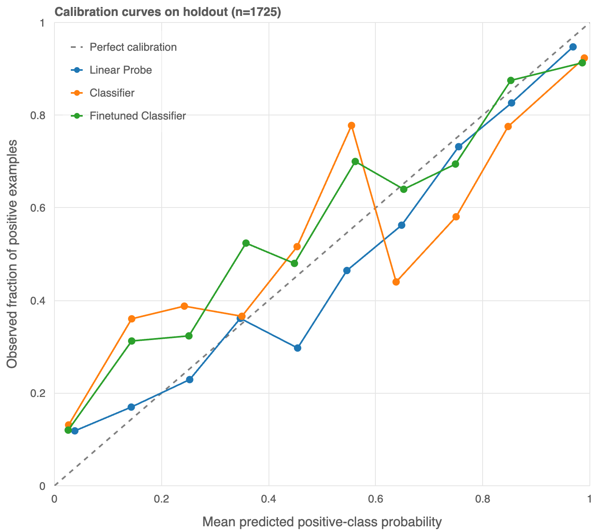

# Анализ классификаторов

##  Данные

Для обучения использованы уникальные промпты из train части датасета WildGuardMix, за исключением пустых строк и
промптов с конфликтующими лэйблами (`"prompt_harm_label"`) и неоднозначными (`"subcategory"`) категориями риска. При обучении 
классификаторов поддерживалась равная пропорция классов в батче, при дообучении ettin-encoder на SupCon батч содержал 8 
различных `"subcategory"` в равной пропорции.

## Модели

Энкодер: [jhu-clsp/ettin-encoder-68m](https://huggingface.co/jhu-clsp/ettin-encoder-68m), эмбеддинги промптов получены
усреднением выхода энкодера

`Embedder` усредняет скрытые состояния последнего слоя для токенов, отмеченных в `attention_mask`;
padding исключается, полностью пустая маска даёт нулевой вектор.
Параметр `pooling_source="hidden_state"` задаёт это поведение по умолчанию.
При `pooling_source="mlm_output"` усредняются выходы предобученной MLM-головы
ModernBERT перед проекцией на словарь: Linear → GELU → LayerNorm.
MLM-голова применяется к каждому токену до усреднения; логиты словаря не вычисляются.

Для обучения только классифицирующей головы передайте
`Classifier(head_hidden_dim=256, freeze_embedder=True)` или задайте
`models.classifier.freeze_embedder: true` в конфиге.
Эмбеддер остаётся в режиме `eval()`, его веса не получают градиентов.
По умолчанию `freeze_embedder=False`: обучаются эмбеддер и голова.

1. Baseline: линейная проба
2. Classifier: классифицирующая голова с hidden_dim=256 и ReLU над энкодером, обученная на CE
3. Finetuned Embedder: эмбеддинги промптов дообучены с помощью SupCon на сближение внутри одной категории риска согласно
разметке в WildGuardMix.
4. Finetuned Classifier: классифицирующая голова с hidden_dim=256 и ReLU над finetuned embedder, обученная на CE

## Метрики

### Holdout выборка: test часть датасета WildGuardMix

Finetuned Classifier лучше ранжирует большинство промптов, это видно по соотношению precision-recall и FPR-TPR на всех порогах,
но по TPR@FPR=0.01 проигрывает бейзлайну.

Распределение скоров на отрицательных объектах подтверждает, что более сложные модели основной массе промптов назначают низкий скор,
но имеют небольшой пик в правой части распределения, в то время как бейзлайн менее подвержен назначать экстремальный скор
негативным объектам.

Проблемные промпты можно найти в [ноутбуке](notebooks/negative_holdout_analysis.ipynb), большинство из них adversarial.

Для vanilla промптов harmful определяются ожидаемо лучше для всех моделей, Finetuned Classifier также лучше ранжирует
промпты, но уступает обычному Classifier по FPR и TPR@FPR=0.01.

Для adversarial промптов ситуация похожая, Finetuned Classifier также лучше ранжирует, но уступает по TPR@FPR=0.01.

 
### OOD выборка: test часть датасета toxic_chat

В датасете toxic_chat доля положительных объектов около 7%, все модели переносятся на новый датасет (PR AUC > 0.07),
но при пороге @FPR=0.01 пропускают больше 80% опасных промптов.

## Калибровочная кривая (holdout dataset)

Бейзлайн лучше откалиброван, сильные скачки для вероятностей в промежутке от 0.2-0.6 для более сложных моделей скорее
свидетельствуют о том, что они склонны давать более экстремальные скоры для проптов и следовательно хуже откалиброваны.

